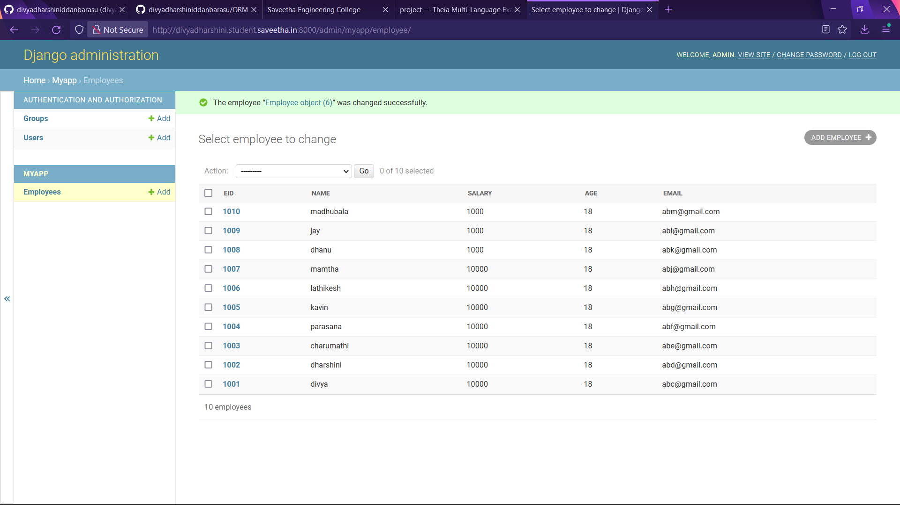

# Django ORM Web Application

## AIM
To develop a Django application to store and retrieve data from a database using Object Relational Mapping(ORM).


## DESIGN STEPS
 ## Step 1:
Create a django project with the name “myfoodblog” 
## Step 2: 
Initiate a database & create data tables for existing models of the generated project in 
the database 
## Step 3:
Open a new windows cli and move to the project workspace. Run the following 
command to start up a local host. 
## Step 4 :
Creating a superuser and refresh http://127.0.0.1:8000/admin/ in your browser & sign 
in 
## Step 5: 
Create an application in the myfoodblog project with the name “cuisine” 
## Step 6: 
Define a cuisine model to handle posts by the owner / users of the blog , edit 
settings.py: 
## Step 7: 
Add your cuisine model to the administration site. Customizing the way models (eg.Cuisine) are displayed in the admin app and  customize the admin model some more.  


## PROGRAM
```
SETTINGS.PY 
Django settings for MyFoodBlog project. 
Generated by ‘django-admin startproject’ using Django 4.2.6. 
For more information on this file, see 
https://docs.djangoproject.com/en/4.2/topics/settings/ 
For the full list of settings and their values, see 
https://docs.djangoproject.com/en/4.2/ref/settings/ 
“”” 
import os 
from pathlib import Path 

# Build paths inside the project like this: BASE_DIR / ‘subdir’. 
BASE_DIR = Path(__file__).resolve().parent.parent 
 
# Quick-start development settings – unsuitable for production 
# See https://docs.djangoproject.com/en/4.2/howto/deployment/checklist/ 
 
# SECURITY WARNING: keep the secret key used in production secret! 
SECRET_KEY = ‘django-insecure
@)&cuctn6pqlkpd&a$i7j#3_qy53#@o8%pte)^_nz!uq21&s0z’ 
 
# SECURITY WARNING: don’t run with debug turned on in production! 
DEBUG = True 
 
ALLOWED_HOSTS = [] 
 
# Application definition 
 
INSTALLED_APPS = [ 
    ‘django.contrib.admin’, 
    ‘django.contrib.auth’, 
    ‘django.contrib.contenttypes’, 
    ‘django.contrib.sessions’, 
    ‘django.contrib.messages’, 
    ‘django.contrib.staticfiles’, 
    ‘cuisine’ 
] 
 
MIDDLEWARE = [ 
    ‘django.middleware.security.SecurityMiddleware’, 
    ‘django.contrib.sessions.middleware.SessionMiddleware’, 
    ‘django.middleware.common.CommonMiddleware’, 
    ‘django.middleware.csrf.CsrfViewMiddleware’, 
    ‘django.contrib.auth.middleware.AuthenticationMiddleware’, 
    ‘django.contrib.messages.middleware.MessageMiddleware’, 
    ‘django.middleware.clickjacking.XframeOptionsMiddleware’, 
] 
 
ROOT_URLCONF = ‘MyFoodBlog.urls’ 
 
TEMPLATES = [ 
    { 
        ‘BACKEND’: ‘django.template.backends.django.DjangoTemplates’, 
        ‘DIRS’: [], 
        ‘APP_DIRS’: True, 
        ‘OPTIONS’: { 
            ‘context_processors’: [ 
                ‘django.template.context_processors.debug’, 
                ‘django.template.context_processors.request’, 
                ‘django.contrib.auth.context_processors.auth’, 
                ‘django.contrib.messages.context_processors.messages’, 
            ], 
        }, 
    }, 
] 
 
WSGI_APPLICATION = ‘MyFoodBlog.wsgi.application’ 
 
# Database 
# https://docs.djangoproject.com/en/4.2/ref/settings/#databases 
 
DATABASES = { 
    ‘default’: { 
        ‘ENGINE’: ‘django.db.backends.sqlite3’, 
        ‘NAME’: BASE_DIR / ‘db.sqlite3’, 
    } 
} 
 
# Password validation 
# https://docs.djangoproject.com/en/4.2/ref/settings/#auth-password-validators 
 
AUTH_PASSWORD_VALIDATORS = [ 
    { 
        ‘NAME’: ‘django.contrib.auth.password_validation.UserAttributeSimilarityValidator’, 
    }, 
    { 
        ‘NAME’: ‘django.contrib.auth.password_validation.MinimumLengthValidator’, 
    }, 
    { 
        ‘NAME’: ‘django.contrib.auth.password_validation.CommonPasswordValidator’, 
    }, 
    { 
        ‘NAME’: ‘django.contrib.auth.password_validation.NumericPasswordValidator’, 
    }, 
] 
 
# Internationalization 
# https://docs.djangoproject.com/en/4.2/topics/i18n/ 
 
LANGUAGE_CODE = ‘en-us’ 
 
TIME_ZONE = ‘UTC’ 
 
USE_I18N = True 
 
USE_TZ = True 
 
# Static files (CSS, JavaScript, Images) 
# https://docs.djangoproject.com/en/4.2/howto/static-files/ 
 
STATIC_URL = ‘static/’ 
 
MEDIA_URL = ‘/pics/’  
MEDIA_ROOT= os.path.join(BASE_DIR, ‘cuisine/pics’) 
 
# Default primary key field type 
# https://docs.djangoproject.com/en/4.2/ref/settings/#default-auto-field 
 
DEFAULT_AUTO_FIELD = ‘django.db.models.BigAutoField’ 
 
MODEL.PY 
 
from django.db import models 
from django.utils import timezone 
from django.contrib.auth.models import User 
 
STATUS_CHOICES = ( 
    (‘draft’, ‘Draft’), 
    (‘published’, ‘Published’), 
) 
 
CATG_CHOICES = ( 
    (‘dessert’, ‘Dessert’), 
    (‘snack’, ‘Snack’), 
    (‘food’, ‘Food’), 
) 
 
class Cuisine(models.Model): 
 
    name = models.CharField(max_length=20) 
    type = models.CharField(max_length=8, 
                              choices=((‘veg’,’Veg’),(‘non veg’,’NV’)), 
                              default=’non veg’) 
    catg = models.CharField(max_length=8, 
                              choices=CATG_CHOICES, 
                              default=’food’) 
     
    desc = models.TextField() 
 
    pic = models.ImageField(upload_to=’cuisine_pic’, blank=True, null=True, ) 
 
 
    author = models.ForeignKey(User, 
                               related_name=’cuisine_user’, 
                               on_delete=models.CASCADE,) 
 
    publish = models.DateTimeField(default=timezone.now) 
    created = models.DateTimeField(auto_now_add=True) 
    updated = models.DateTimeField(auto_now=True) 
 
    slug = models.SlugField(max_length=30, unique_for_date=’publish’) 
 
    status = models.CharField(max_length=10, 
                              choices=STATUS_CHOICES, 
                              default=’draft’) 
 
    class Meta: 
        ordering = (‘-publish’,) 
 
    def __str__(self): 
        return self.name 
```
## OUTPUT


## RESULT
Thus the program for creating database using ORM has been created successfully. 
